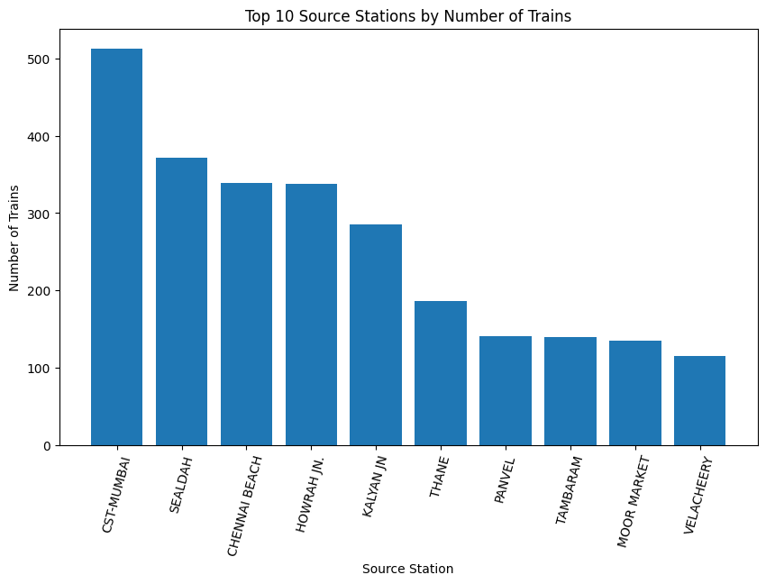
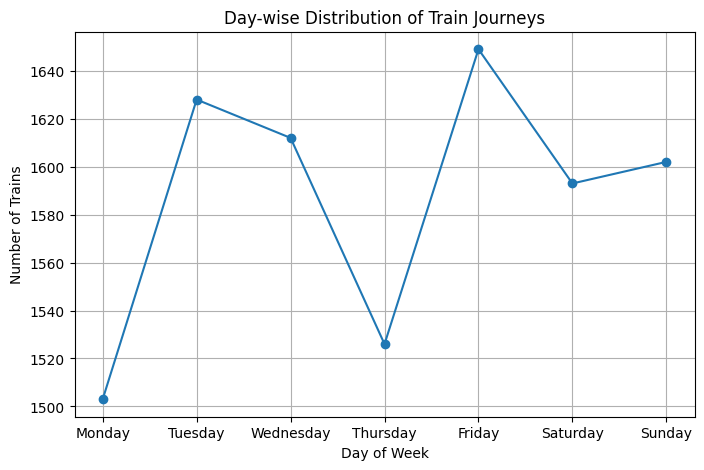
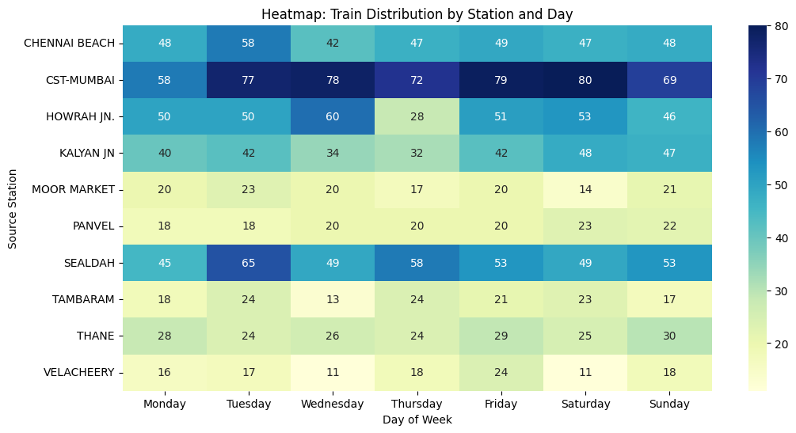

# 🚆 Railway Data Engineering Pipeline using PySpark

  
  
  
  
  
  
  

  An end-to-end railway data engineering and analytics project using PySpark for data processing, transformation, analysis, visualization, and reporting.

---

# 📌 Project Overview

This project demonstrates a complete **Data Engineering and Analytics workflow using PySpark**.

The railway dataset is analyzed to identify:

- 🚆 Train operation patterns
- 🚉 Major source and destination stations
- 🛤️ High-frequency railway routes
- 📅 Day-wise train distribution
- 📊 Weekday vs weekend services
- 🔍 Station-level trends
- 💡 Operational insights and recommendations

The complete workflow transforms raw railway CSV data into meaningful analytical insights.

---

# ⚙️ Architecture / Workflow

<table align="center">
<tr>

<td align="center">

### 📄

**Railway CSV**

</td>

<td>➡️</td>

<td align="center">

### ⚡

**Data Loading**

**PySpark**

</td>

<td>➡️</td>

<td align="center">

### 🧹

**Cleaning &**

**Transformation**

</td>

<td>➡️</td>

<td align="center">

### 📊

**Aggregation &**

**Analysis**

</td>

<td>➡️</td>

<td align="center">

### 📈

**Visualization**

</td>

<td>➡️</td>

<td align="center">

### ✅

**Insights &**

**Reporting**

</td>

</tr>
</table>

---

# 📊 Key Results

<table align="center">
<tr>
<th>Metric</th>
<th>Result</th>
<th>Metric</th>
<th>Result</th>
</tr>

<tr>
<td>Total Records</td>
<td><b>11,113</b></td>
<td>Unique Trains</td>
<td><b>11,113</b></td>
</tr>

<tr>
<td>Source Stations</td>
<td><b>921</b></td>
<td>Destination Stations</td>
<td><b>924</b></td>
</tr>

<tr>
<td>Top Source Station</td>
<td><b>CST-MUMBAI</b></td>
<td>Top Destination Station</td>
<td><b>CST-MUMBAI</b></td>
</tr>

<tr>
<td>Top Source Services</td>
<td><b>513</b></td>
<td>Top Destination Services</td>
<td><b>514</b></td>
</tr>

<tr>
<td>Weekday Services</td>
<td><b>7,918</b></td>
<td>Weekend Services</td>
<td><b>3,195</b></td>
</tr>

<tr>
<td>Most Frequent Route</td>
<td><b>TAMBARAM → CHENNAI BEACH</b></td>
<td>Route Services</td>
<td><b>137</b></td>
</tr>

</table>

---

# 🎨 Visualizations

The project contains visualizations created using **Matplotlib, Seaborn, and Plotly**.

<table align="center">

<tr>

<td align="center">

 

<b>📊 Top 10 Source Stations</b>

</td>

<td align="center">

 

<b>📈 Day-wise Train Distribution</b>

</td>

</tr>

<tr>

<td align="center">

 

<b>🔥 Station vs Day Heatmap</b>

</td>
---

# 📂 Dataset

The project uses railway train service information.

## Dataset Columns

| Column | Description |
|---|---|
| `Train_No` | Train number |
| `Train_Name` | Train name |
| `Source_Station_Name` | Starting station |
| `Destination_Station_Name` | Destination station |
| `days` | Operating day |

### Dataset Size

**11,113 railway records**

---

# 🔍 Level 1 — Data Exploration

## Task 1.1 — Load and Inspect Data

The railway dataset was loaded using PySpark.

Performed:

- Loaded the CSV dataset
- Displayed the first 10 records
- Inspected schema
- Checked data types
- Checked missing values

## Task 1.2 — Basic Statistics

Calculated:

- Total number of trains
- Unique source stations
- Unique destination stations
- Most common source station
- Most common destination station

## Task 1.3 — Data Cleaning

Performed:

- Missing-value identification
- Missing-value handling
- Station-name standardization
- Uppercase conversion
- Whitespace removal

---

# ⚙️ Level 2 — Data Transformation

## Task 2.1 — Data Filtering

Filtered railway data based on:

- Operating day
- Source station

Examples:

- Saturday trains
- Trains starting from `MADGOAN JN.`

## Task 2.2 — Grouping and Aggregation

Performed:

- Train count by source station
- Average trains per operating day
- Source-destination route aggregation

## Task 2.3 — Data Enrichment

Created a new `Train_Category` column.

Monday - Friday   → Weekday
Saturday - Sunday → Weekend

---

# 📊 Level 3 — Advanced Data Analysis

## Task 3.1 — Pattern Analysis

Analyzed:

- Day-wise train distribution
- Frequent railway routes
- Major source stations
- Source-destination patterns
- Train operation trends

## Task 3.2 — Correlation Analysis

Calculated the correlation between day number and train count.

### Correlation Result

**0.3806**

This indicates a positive relationship between the day number and train count in the analyzed dataset, although the relationship is not strong.

---

# 📈 Level 4 — Visualization & Reporting

## Task 4.1 — Visualization

Created:

- Bar charts
- Line charts
- Heatmaps
- Interactive Plotly visualization

### Visualization Tools

- Matplotlib
- Seaborn
- Plotly

## Task 4.2 — Automated Reporting

A PySpark-based automated report was created containing:

- Dataset summary
- Station-level insights
- Day-wise train distribution
- Weekday vs weekend analysis
- Route analysis
- Correlation analysis
- Key insights
- Business recommendations
- Executive summary

### 📄 Detailed Report

[View Railway Data Engineering Report](reports/Railway_Data_Engineering_Report.md)

---

# 🚉 Station Insights

## 🥇 Top Source Station

**CST-MUMBAI**

**513 train services**

## 🥇 Top Destination Station

**CST-MUMBAI**

**514 train services**

CST-MUMBAI acts as a major railway hub within the analyzed dataset.

---

# 🛤️ Route Analysis

## Most Frequent Route

### TAMBARAM → CHENNAI BEACH

**137 services**

Other high-frequency routes identified include:

- CST-MUMBAI → PANVEL
- PANVEL → CST-MUMBAI
- RAVLI JN → CST-MUMBAI
- VELACHEERY → CHENNAI BEACH
- CHENNAI BEACH → TAMBARAM

---

# 📅 Day-wise Train Distribution

| Day | Train Services |
|---|---:|
| Monday | 1,503 |
| Tuesday | 1,628 |
| Wednesday | 1,612 |
| Thursday | 1,526 |
| Friday | 1,649 |
| Saturday | 1,593 |
| Sunday | 1,602 |

### 🏆 Highest

**Friday — 1,649 trains**

### 📉 Lowest

**Monday — 1,503 trains**

---

# 📊 Weekday vs Weekend

| Category | Train Services |
|---|---:|
| Weekday | **7,918** |
| Weekend | **3,195** |

The dataset shows significantly more train services during weekdays compared with weekends.

---

# 📊 Key Results Summary

| Metric | Result |
|---|---:|
| Total Records | **11,113** |
| Total Unique Trains | **11,113** |
| Unique Source Stations | **921** |
| Unique Destination Stations | **924** |
| Top Source Station | **CST-MUMBAI** |
| Top Source Services | **513** |
| Top Destination Station | **CST-MUMBAI** |
| Top Destination Services | **514** |
| Weekday Services | **7,918** |
| Weekend Services | **3,195** |
| Most Frequent Route | **TAMBARAM → CHENNAI BEACH** |
| Top Route Services | **137** |
| Day/Train Correlation | **0.3806** |

---

# 💡 Key Insights

- 🚉 **CST-MUMBAI** is the most frequent source station.
- 🚉 **CST-MUMBAI** is also the most frequent destination station.
- 🛤️ **TAMBARAM → CHENNAI BEACH** is the most frequent route identified.
- 📅 Train services are more concentrated during weekdays.
- 🚆 Major railway hubs account for a significant portion of train services.
- 📊 Day-wise analysis provides useful operational patterns.
- 🔄 Several high-frequency routes operate in both directions.
- 📈 The calculated day/train correlation is **0.3806**.

---

# 📌 Business Recommendations

### 1. 🚉 Optimize Major Railway Hubs

Focus scheduling and infrastructure planning on high-traffic stations.

### 2. 📊 Improve Capacity Planning

Use day-wise train patterns for better resource and capacity planning.

### 3. 🛤️ Analyze High-Frequency Routes

Monitor high-frequency routes for potential scheduling optimization.

### 4. 📅 Evaluate Weekend Demand

Analyze passenger demand before increasing or reducing weekend services.

### 5. 🏗️ Support Infrastructure Planning

Use station-level and route-level analytics to identify locations that may require additional infrastructure.

---

# 🧰 Technologies Used

| Technology | Purpose |
|---|---|
| Python | Programming and analysis |
| PySpark | Data processing and transformation |
| Pandas | DataFrame conversion for visualization |
| Matplotlib | Bar and line charts |
| Seaborn | Heatmap visualization |
| Plotly | Interactive visualization |
| Google Colab | Development environment |

---
## 👩‍💻 Author
### Zuha Tazeen
Data Engineering | PySpark | Python | SQL | Azure
